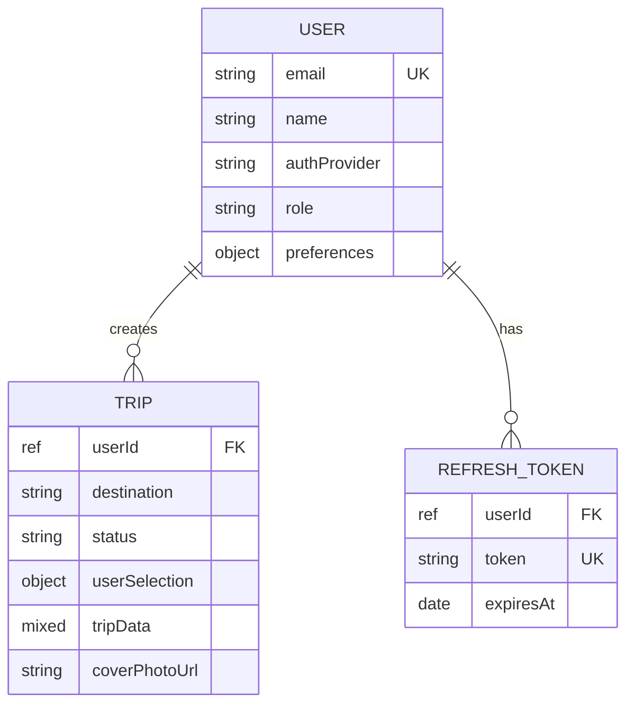

<p align="center">
  
  
  
  
  
</p>

<h1 align="center">🛫 Vegaa AI — AI-Powered Travel Planner</h1>

<p align="center">
  <strong>Plan your perfect trip in minutes.</strong><br/>
  An intelligent travel planner that uses Google Gemini AI to generate personalized, day-by-day itineraries<br/>
  complete with hotels, restaurants, places to visit, local tips, and more.
</p>

<p align="center">
  <a href="#-features">Features</a> •
  <a href="#-architecture">Architecture</a> •
  <a href="#-tech-stack">Tech Stack</a> •
  <a href="#-quick-start">Quick Start</a> •
  <a href="#-project-structure">Project Structure</a> •
  <a href="#-documentation">Documentation</a>
</p>

---

## ✨ Features

<table>
<tr>
<td width="50%">

### 🤖 AI-Powered Planning
Generate complete travel itineraries with a single click. Gemini AI creates day-by-day plans tailored to your destination, budget, and travel style.

### 🔐 Secure Authentication
Dual authentication with email/password and Google OAuth. JWT access + refresh token rotation for maximum security.

### 📸 Dynamic Imagery 
Beautiful travel photography from Pexels. Smart caching ensures fast loading and minimal API usage.

</td>
<td width="50%">

### 🗺 Smart Search
Google Places autocomplete for instant destination suggestions. Search cities, get details, view on map.

### 🌤 Live Weather
Real-time weather data from OpenWeather so you know what to expect at your destination.

### 📱 Premium Mobile Experience
iOS-inspired glassmorphism design with spring animations, 3D card effects, and responsive layouts that look stunning on any device.

</td>
</tr>
</table>

---

## 🏗 Architecture

```
┌─────────────────────────────────────────────────────────────────────┐
│                          Client (Browser)                            │
│                                                                      │
│  ┌────────────────────────────────────────────────────────────────┐  │
│  │         React SPA (Vite + TailwindCSS + Framer Motion)        │  │
│  │                                                                │  │
│  │  Landing ─── Auth ─── Create Trip ─── View Trip ─── My Trips  │  │
│  │                                                                │  │
│  │  ┌──────────────────────────────────────────────────────────┐  │  │
│  │  │  API Client Layer (Axios + Token Interceptors)           │  │  │
│  │  │  auth.js · trips.js · ai.js · images.js · places.js     │  │  │
│  │  └──────────────────────────┬───────────────────────────────┘  │  │
│  └─────────────────────────────┼──────────────────────────────────┘  │
│                                │                                     │
└────────────────────────────────┼─────────────────────────────────────┘
                                 │ HTTPS (REST API)
                                 │
┌────────────────────────────────┼─────────────────────────────────────┐
│                                ▼                                     │
│                    Express.js Backend (Node.js)                      │
│                                                                      │
│  ┌──────────────────────────────────────────────────────────────┐    │
│  │  Middleware: Helmet · CORS · Rate Limit · JWT Auth · Joi    │    │
│  └──────────────────────────────────────────────────────────────┘    │
│                                                                      │
│  ┌──────────┐  ┌──────────┐  ┌──────────┐  ┌──────────┐            │
│  │  Routes  │→ │Controllers│→ │ Services │→ │  Repos   │            │
│  └──────────┘  └──────────┘  └──────────┘  └──────────┘            │
│                                    │                │                │
│                          ┌─────────┼────────────────┤                │
│                          ▼         ▼                ▼                │
│                    ┌──────────┐ ┌──────┐    ┌──────────────┐        │
│                    │ External │ │Cache │    │   MongoDB    │        │
│                    │  APIs    │ │(RAM) │    │   Atlas      │        │
│                    └──────────┘ └──────┘    └──────────────┘        │
│                    Gemini · Pexels                                    │
│                    Google Places                                     │
│                    OpenWeather                                       │
└──────────────────────────────────────────────────────────────────────┘
```

### Data Flow Summary

| Flow | Path |
|:---|:---|
| **User signs in** | Frontend → `POST /api/auth/login` → bcrypt verify → JWT issued → httpOnly cookie set |
| **Trip creation** | Frontend → `POST /api/ai/generate-trip` → Gemini AI → JSON parse → save to MongoDB |
| **View trip** | Frontend → `GET /api/trips/:id` → MongoDB → render with dynamic Pexels images |
| **Image loading** | Frontend → `GET /api/images/search` → cached Pexels response → render |
| **Token refresh** | Automatic via Axios 401 interceptor → `POST /api/auth/refresh` → token rotation |

---

## 🧰 Tech Stack

### Frontend
| Technology | Version | Purpose |
|:---|:---:|:---|
| React | 18.2 | UI components with hooks |
| Vite | 7.x | Build tool with HMR |
| Tailwind CSS | 3.x | Utility-first styling |
| Framer Motion | 12.x | Animations & transitions |
| React Router | 6.x | Client-side routing |
| Axios | Latest | HTTP client with interceptors |
| Radix UI | Latest | Accessible UI primitives |
| Sonner | 2.x | Toast notifications |

### Backend
| Technology | Version | Purpose |
|:---|:---:|:---|
| Node.js | 22+ | JavaScript runtime |
| Express.js | 4.x | Web framework |
| MongoDB + Mongoose | 8.x | Database + ODM |
| JWT + bcryptjs | Latest | Authentication |
| Joi | 17.x | Request validation |
| Helmet + CORS | Latest | Security hardening |
| node-cache | 5.x | In-memory TTL caching |

### External APIs
| API | Provider | Usage |
|:---|:---|:---|
| Generative AI | Google Gemini 2.5 Flash | AI trip itinerary generation |
| Places API | Google Maps Platform | City autocomplete & place details |
| Image Search | Pexels | Travel photography |
| Weather API | OpenWeatherMap | Live weather data |
| OAuth 2.0 | Google Identity | Social sign-in |

---

## 🚀 Quick Start

### Prerequisites
- **Node.js** ≥ 18 (22+ recommended)
- **MongoDB Atlas** account
- API keys: Gemini, Pexels, Google Places, OpenWeather, Google OAuth

### 1. Clone the Repository

```bash
git clone https://github.com/your-username/Vegaa_AI.git
cd Vegaa_AI
```

### 2. Setup Backend

```bash
cd backend
npm install

# Create .env (see backend/README.md for all variables)
# Required: MONGODB_URI, JWT_ACCESS_SECRET, JWT_REFRESH_SECRET
```

### 3. Setup Frontend

```bash
cd ../frontend
npm install

# Create .env.local
# Required: VITE_API_URL, VITE_GOOGLE_AUTH_CLIENT_ID
```

### 4. Run Both Servers

```bash
# Terminal 1 — Backend (port 5000)
cd backend
npm run dev

# Terminal 2 — Frontend (port 5173)
cd frontend
npm run dev
```

### 5. Open the App

Visit **http://localhost:5173** 🎉

---

## 📁 Project Structure

```
Vegaa_AI/
│
├── 📂 backend/                  # Express.js REST API
│   ├── server.js                # Entry point
│   └── src/
│       ├── config/              # Environment, DB, CORS config
│       ├── models/              # Mongoose schemas (User, Trip, RefreshToken)
│       ├── repositories/        # Data access layer (DB queries)
│       ├── services/            # Business logic (auth, AI, trip, image, etc.)
│       ├── controllers/         # HTTP handlers (request/response)
│       ├── routes/              # Route definitions with middleware
│       ├── middleware/          # Auth, validation, rate limiting, errors
│       └── utils/               # Cache, helpers, logger
│
├── 📂 frontend/                 # React SPA
│   ├── index.html               # HTML entry
│   └── src/
│       ├── api/                 # API client modules (auth, trips, AI, etc.)
│       ├── contexts/            # React Context providers (AuthContext)
│       ├── services/            # Trip generation orchestrator
│       ├── components/          # UI components (custom, ui, layout, misc)
│       ├── create-trip/         # Trip creation wizard page
│       ├── view-trip/           # Trip viewer page + section components
│       ├── edit-trip/           # Trip editor page
│       ├── my-trips/            # User's trips gallery page
│       ├── profile/             # User profile & stats page
│       ├── about/               # About Us page
│       ├── auth/                # Login/register page
│       └── lib/                 # Utilities (image service, luminance hook)
│
├── .gitignore
└── README.md                    # ← You are here
```

---

## 📖 Documentation

For detailed documentation, see the individual README files:

| Document | Description |
|:---|:---|
| **[Backend README](./backend/README.md)** | Full API reference, ER diagrams, auth flows, middleware pipeline, security, deployment |
| **[Frontend README](./frontend/README.md)** | Component hierarchy, API integration map, state management, design system, build config |

---

## 🔒 Security Highlights

| Layer | Protection |
|:---|:---|
| **Transport** | HTTPS everywhere, CORS whitelist, Helmet security headers |
| **Authentication** | JWT with short-lived access tokens (15min), httpOnly refresh cookies |
| **Token Security** | Refresh token rotation (old deleted, new issued on every refresh) |
| **Password Storage** | bcrypt with 12 salt rounds |
| **Input Validation** | Joi schemas on all endpoints with `stripUnknown: true` |
| **Rate Limiting** | Tiered limits per endpoint type (auth: 10/15min, AI: 10/hr, API: 300/hr) |
| **Error Handling** | Production mode hides internal error details from clients |
| **Data Access** | Ownership enforcement on all trip mutations (`userId` in query filter) |

---

## 📊 Entity-Relationship Overview



---

## 🤝 Contributing

1. Fork the repository
2. Create a feature branch: `git checkout -b feature/amazing-feature`
3. Commit your changes: `git commit -m 'Add amazing feature'`
4. Push to the branch: `git push origin feature/amazing-feature`
5. Open a Pull Request

---

## 📄 License

This project is proprietary software. All rights reserved.

---

<p align="center">
  <sub>Built with ❤️ by the Vegaa AI Team · Powered by Google Gemini AI</sub>
</p>
